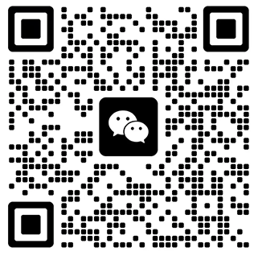

# NICE 86期 | 大语言模型在翻译中的局限与前景

## 主题

大语言模型在翻译中的局限与前景

## 时间

2025.9.5 20:00

## 内容

机器翻译，作为一个单纯的条件语言任务，常被当做检验模型语言建模能力的一个重要基准。大语言模型显著提升了现代机器翻译的质量。围绕大语言模型的一些代表性的能力，如few-shot，长文本理解，推理等，衍生出了大量的应用，包括最近在翻译任务中的一些探索。本次分享主要关于：大语言模型在翻译以外的能力/特点是否对翻译问题本身有帮助，并讨论大语言模型在翻译任务中的局限与前景。
分享内容主要围绕近期的几篇工作，分别关于：
[1] Can LLMs Really Learn to Translate a Low-Resource Language from One Grammar Book?
—— ICLR25 Spotlight
大语言模型是否可以脱离平行语料做翻译？大语言模型“呈现”出一些类人的智能，包括从长的上下文中“学习”，并据此完成任务。比如，谷歌团队提出仅从一本语法书中学会对于极低资源语言的翻译的“可能性”。本文通过设计一系列解构实验，否定这种可能，挑战了对于大语言模型"学习"能力的乐观预期。
[2] Please Translate Again: Two Simple Experiments on Whether Human-Like Reasoning Helps Translation
—— EMNLP25
大语言模型呈现出来的“推理”能力是否有助于翻译？大模型通过类人的推理/CoT解构复杂任务。近期一些研究利用大模型模拟人类专家翻译行为，以提升翻译性能。本文对这一范式进行审查，通过对比实验讨论该范式的局限性。
[3] Calibrating Translation Decoding with Quality Estimation on LLMs
—— arXiv25
翻译常被建模成最大似然估计问题，并依照最大后验概率(MAP)进行解码。但模型往往存在校准问题，导致解码效果受限。本文提出了一种方法将大模型的翻译置信度与下游评估的分布进行校准，从而在达到高效解码的同时，实现对翻译优化与质量评估两个任务的统一建模。

### 入群

欢迎加入NICE每周分享交流群，可与NICEer唠嗑，以及第一时间收到后续NICE分享报告的通知。加群通过小助手认证，群内无广告。

备注【昵称-单位-方向-NICE入群】

